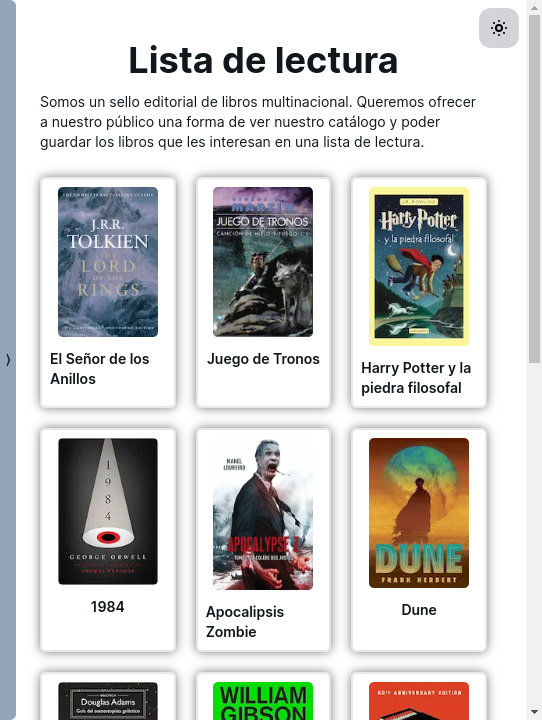
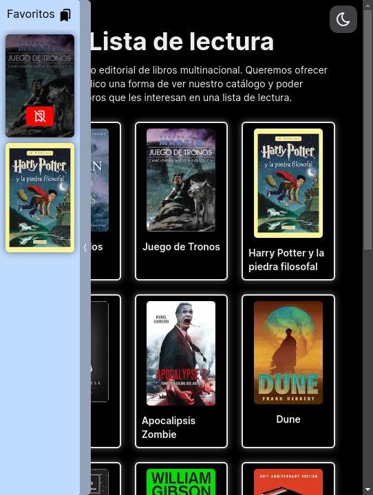

# Reading List App

## Description

This is a simple app that allows users to create a reading list. Users can add
books to the list, and mark them as read or unread. Users can also delete books
from the list.

## First Version

### Light Mode

### Dark Mode

## Technologies Used

## More Information

This app is part of the challenge from [***Pruebas Técnicas de
Programación***](https://pruebastecnicas.com/) from
[***@midudev***](https://midu.dev/). The goal of this challenge is to design and
implement a small web application for a reading list using the tools of your
choice. The app should have the following features:

- [X] **Book List View**: The app should show a list of books that the user
    can review.
- [X] **Reading List Creation**: The user should be able to create a reading
- [ ] **Book Filtering by Genre**: Users should be able to filter the list of
    available books by genre, and a counter will be displayed with the number of
    available books, the number of books in the reading list and the number of
    books available in the selected genre.
- [X] **State Synchronization**: There must be a global state synchronization
- [X] **Data Persistence**: The app should persist the reading list data in the
    browser's local storage. When reloading the page, the reading list should be
    maintained.
- [ ] **Tab Synchronization**: If the user opens the app in two different tabs,
    the changes made in one tab should be reflected in the other. No need to use
    Backend.
- [ ] **Deployment**: The app should be deployed on some free hosting service
- [ ] **Test**: The app should have AT LEAST one test. Do the test you consider
    most important for your app.

You can find the original challenge in the following
[link](https://github.com/midudev/pruebas-tecnicas/tree/main/pruebas/01-reading-list)

## Additional Features

- [X] **Dark Mode**: The app should have a dark mode.
- [X] **Responsive Design**: The app should be responsive.
